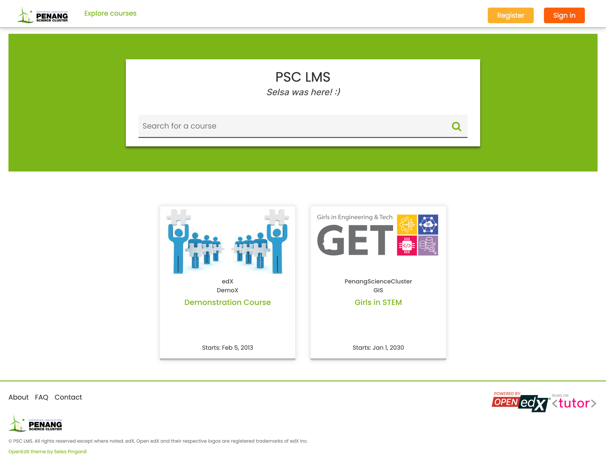
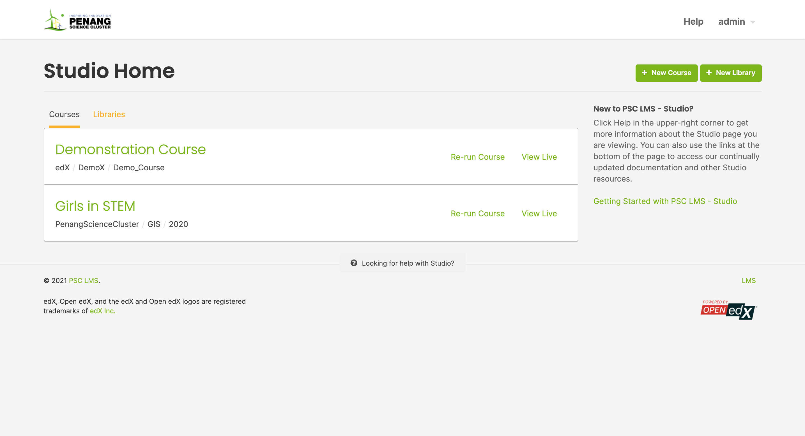

PSC Theme for Open EdX CMS & LMS
======================================

This PSC theme is a customizable theme for `Open edX <https://open.edx.org>`__.

It was specifically designed for Penang Science Cluster's LMS and CMS.

**Note**: This version of the PSC theme is compatible with the Lilac release of Open EdX.

Installation
------------

The PSC theme was specially developed to be used with `Tutor <https://docs.overhang.io>`__ (at least v12.0.0). If you have not installed Open EdX with Tutor, then installation instructions will vary.

Clone the theme repository::

    git clone https://github.com/selsapingardi/openedx_themes

Rebuild the Open Edx docker image::

    tutor images build openedx

Restart your platform::

    tutor local start -d

You will then have to enable the "openedx_themes" theme, as per the `Tutor documentation <https://docs.tutor.overhang.io/local.html#setting-a-new-theme>`__::

    tutor local settheme openedx_themes $(tutor config printvalue LMS_HOST) $(tutor config printvalue CMS_HOST)

Upgrade
-------

To upgrade the PSC theme from a previous version, simply pull the changes from the git repository::

    cd openedx_themes/
    git pull

Copy the changed files from the openedx_themes git repository into the Tutor root folder, as per the `Tutor documentation <https://docs.tutor.overhang.io/dev.html#customised-themes>`__::

    cp -r /path/to/openedx_themes/theme/ "$(tutor config printroot)/env/build/openedx/themes/openedx_themes/"

Stop the local platform::

    tutor local stop

Then run the commands above starting from ``tutor images build openedx``.

Development Environment
-----------------------

Re-building images to view changes (especially minor ones!) on the site takes some time and is highly inefficient. Making use of the local development webserver allows you to preview the changes made to your site before having to deploy it officially.

Make sure to **stop the local platform** before running the development environment so that they do not interfere with each other, as per the `Tutor documentation <https://docs.tutor.overhang.io/dev.html#>`__.

Firstly, build the Open Edx development docker image::

    tutor images build openedx-dev

Then, as per the `Tutor documentation <https://docs.tutor.overhang.io/dev.html#customised-themes>`__, host a local webserver by running the command::

    tutor dev runserver lms

Note: To access the CMS webserver, substitute ``lms`` with ``cms``.

Collect the assets with::

    tutor dev run lms openedx-assets build --env=dev

Again, ``lms`` may be substituted with ``cms`` depending on which system you are customizing.

The theme must then be enabled by running the command (replace sitename.com with your respective LMS and CMS domain names)::

    tutor dev settheme openedx_themes sitename.com:8000 studio.sitename.com:8001

Re-build the development docker image::

    tutor images build openedx-dev

In another terminal, watch the themes folders for changes and leave it running::

    tutor dev run watchthemes

Make changes to some of the files inside the theme directory by using the steps shown in the **Customization** section below.
Then, follow the steps shown in the **Upgrade** section above, starting from ``cd openedx_themes/`` to automatically recompile and see your changes at your development site (http://sitename.com:8000) / (http://local.sitename.com:8001).

To stop the local webserver from running, use the command::

    tutor dev stop

Customization
-------------

Important note!
~~~~~~~~~~~~~~~

Before customizing, it is important to understand that the development environment and the local platform make use of different theming files:

    In the development environment, the *CSS files*: `openedx_themes/theme/lms/static/css/lms-main-v1.css <https://github.com/selsapingardi/openedx_themes/tree/master/theme/lms/static/css/lms-main-v1.css>`__ and `openedx_themes/theme/cms/static/css/studio-main-v1.css <https://github.com/selsapingardi/openedx_themes/tree/master/theme/cms/static/css/studio-main-v1.css>`__ are sufficient to customize the theme without the need for the SASS files.

    However, in the local platform, the CSS files above are not read or recompiled by Tutor, but the SASS files are. Thus, the CSS files located in the respective CSS folders essentially have the same content as the one found in the *Extras SASS* files: `openedx_themes/theme/lms/static/sass/_extras.scss <https://github.com/selsapingardi/openedx_themes/tree/master/theme/lms/static/sass/_extras.scss>`__ and `openedx_themes/theme/cms/static/sass/_extras.scss <https://github.com/selsapingardi/openedx_themes/tree/master/theme/cms/static/sass/_extras.scss>`__. 

The code written in the SASS files **overwrite** the CSS files that are not accessible in the local platform. So to ensure that there are no overlaps in the CSS properties, change any unwanted CSS property declaration to ``none`` (or its equivalent), instead of removing the entire CSS declaration.

Setting custom values
~~~~~~~~~~~~~~~~~~~~~

All of the CSS code used to customize the website can be found in the *Extras SASS* file `openedx_themes/theme/lms/static/sass/_extras.scss <https://github.com/selsapingardi/openedx_themes/tree/master/theme/lms/static/sass/_extras.scss>`__ for the LMS, and in `openedx_themes/theme/cms/static/sass/_extras.scss <https://github.com/selsapingardi/openedx_themes/tree/master/theme/cms/static/sass/_extras.scss>`__ for the CMS. 

To configure which CSS properties to change:

1. Use your browser's Developer Tools and inspect the element you want to change.
2. Take note of the element's exact CSS selector and properties.
3. Use the Search function on your Code Editing Software to look for the element (using the selector name).
4. Change the CSS properties to however you'd like it to be displayed.

Then simply follow the commands found in the **Upgrade** section.

Changing the default logo and other images
~~~~~~~~~~~~~~~~~~~~~~~~~~~~~~~~~~~~~~~~~~

The theme images are stored in `openedx_themes/theme/lms/static/images <https://github.com/selsapingardi/openedx_themes/tree/master/theme/lms/static/images>`__ for the LMS, and in `openedx_themes/theme/cms/static/images <https://github.com/selsapingardi/openedx_themes/tree/master/theme/cms/static/images>`__ for the CMS. 

To use custom images in your theme, just **replace** the files stored in these folders with your own prior to running ``tutor images build openedx``.
If your logo does not appear, make sure that you use the same image name as the **default** (logo.png, studio-logo.png, favicon.ico and so on).

Overriding the default "about", "contact", etc. static pages
~~~~~~~~~~~~~~~~~~~~~~~~~~~~~~~~~~~~~~~~~~~~~~~~~~~~~~~~~~~~

By default, the ``/about`` and ``/contact`` pages contain a simple line of text. In the following, we detail how to override just any of the static templates used in Open edX.

The static templates used by Open EdX to render those pages are all stored in the `openedx_themes/lms/templates/static_templates <https://github.com/selsapingardi/openedx_themes/tree/master/theme/lms/templates/static_templates>`__ folder.

For instance, edit the "faq.html" file in this directory. We can derive the content of this file from the contents of the `faq.html <https://github.com/selsapingardi/openedx_themes/tree/master/theme/lms/templates/static_templates/faq.html>`__ static template::

    <%page expression_filter="h"/>
    <%! from django.utils.translation import ugettext as _ %>
    <%inherit file="../main.html" />

    <%block name="pagetitle">${_("FAQ")}</%block>

    <main id="main" aria-label="Content" tabindex="-1">
        <section class="container about">
            <h1>
                <%block name="pageheader">${page_header or _("FAQ")}</%block>
            </h1>
            

                Frequently Asked Questions will be placed here soon. Check back again next time!
            

        </section>
    </main>

This new template will then be used to render the /faq url.

License
-------

This work is licensed under the terms of the `GNU Affero General Public License (AGPL) <https://github.com/overhangio/indigo/blob/master/LICENSE.txt>`_.
